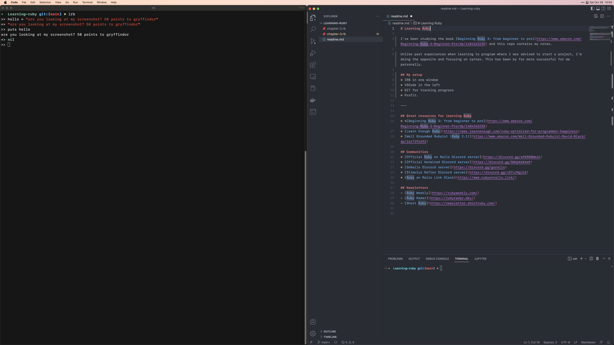

# Learning Ruby

I've been studying the book [Beginning Ruby 3: from beginner to pro](https://www.amazon.com/Beginning-Ruby-3-Beginner-Pro/dp/1484263235) and this repo contains my notes. 

Unlike past experiences when learning to program where I was advised to start a project, I'm doing the opposite and focusing on syntax. This has been by far more successful for me personally. 

## My setup 
IRB in one window | VSCode in the left | GIT for tracking progress | Profit.
 
 

---

## Great resources for learning Ruby 
* [Beginning Ruby 3: from beginner to pro](https://www.amazon.com/Beginning-Ruby-3-Beginner-Pro/dp/1484263235)
* [Learn Enough Ruby](https://news.learnenough.com/ruby-optimized-for-programmer-happiness)
* [Well Grounded Rubyist (Ruby 2.1)](https://www.amazon.com/Well-Grounded-Rubyist-David-Black/dp/1617291692)

## Communities
* [Official Ruby on Rails Discord server](https://discord.gg/a9KR88WmJn)
* [Official Hotwired Discord server](https://discord.gg/SWUpK6Kkm9)
* [GoRails Discord server](https://discord.gg/gorails)
* [Stimulus Reflex Discord server](https://discord.gg/z5fuJNgJsS)
* [Ruby on Rails Link Slack](https://www.rubyonrails.link/)

## Newsletters
- [Ruby Weekly](https://rubyweekly.com/)
- [Ruby Radar](https://rubyradar.dev/)
- [Short Ruby](https://newsletter.shortruby.com/)

